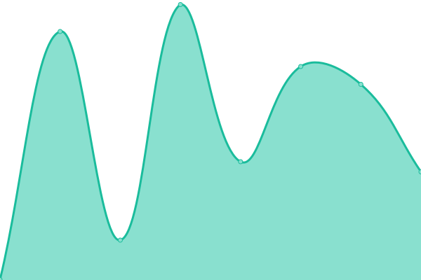
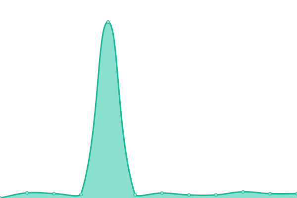

# [📈 Live Status](https://upptime.cebre.us): <!--live status--> **🟩 All systems operational**

This repository contains the open-source uptime monitor and status page for [Jaroslav Vrána](https://www.cebre.us/), powered by [Upptime](https://github.com/upptime/upptime).

With [Upptime](https://upptime.js.org), you can get your own unlimited and free uptime monitor and status page, powered entirely by a GitHub repository. We use [Issues](https://github.com/cebreus/upptime/issues) as incident reports, [Actions](https://github.com/cebreus/upptime/actions) as uptime monitors, and [Pages](https://upptime.cebre.us) for the status page.

<!--start: status pages-->
<!-- This summary is generated by Upptime (https://github.com/upptime/upptime) -->
<!-- Do not edit this manually, your changes will be overwritten -->
<!-- prettier-ignore -->
| URL | Status | History | Response Time | Uptime |
| --- | ------ | ------- | ------------- | ------ |
|  [Ada-Net.cz](https://www.ada-net.cz/) | 🟩 Up | [ada-net-cz.yml](https://github.com/cebreus/upptime/commits/HEAD/history/ada-net-cz.yml) | 

 887ms
     
 | 

<a href="https://upptime.cebre.us/history/ada-net-cz">100.00%</a>
    

|  [Cebreus](https://www.cebre.us/) | 🟩 Up | [cebreus.yml](https://github.com/cebreus/upptime/commits/HEAD/history/cebreus.yml) | 

 239ms
     
 | 

<a href="https://upptime.cebre.us/history/cebreus">100.00%</a>
    

|  [tanecni-divadlo.cz](https://www.tanecni-divadlo.cz) | 🟩 Up | [tanecni-divadlo-cz.yml](https://github.com/cebreus/upptime/commits/HEAD/history/tanecni-divadlo-cz.yml) | 

 9519ms
     
 | 

<a href="https://upptime.cebre.us/history/tanecni-divadlo-cz">92.63%</a>
    

|  [Opus organum](https://www.opus-organum.eu/) | 🟩 Up | [opus-organum.yml](https://github.com/cebreus/upptime/commits/HEAD/history/opus-organum.yml) | 

 223ms
     
 | 

<a href="https://upptime.cebre.us/history/opus-organum">100.00%</a>
    

|  [Silberbauerovo hudební Podyjí](https://www.hudebnipodyji.eu/) | 🟩 Up | [silberbauerovo-hudebni-podyji.yml](https://github.com/cebreus/upptime/commits/HEAD/history/silberbauerovo-hudebni-podyji.yml) | 

 320ms
     
 | 

<a href="https://upptime.cebre.us/history/silberbauerovo-hudebni-podyji">100.00%</a>
    

|  [Sébastien Thomas Bagnoud](https://www.sebastienbagnoud.eu/) | 🟩 Up | [sebastien-thomas-bagnoud.yml](https://github.com/cebreus/upptime/commits/HEAD/history/sebastien-thomas-bagnoud.yml) | 

 750ms
     
 | 

<a href="https://upptime.cebre.us/history/sebastien-thomas-bagnoud">100.00%</a>
    

|  Bali 2017 | 🟩 Up | [bali-2017.yml](https://github.com/cebreus/upptime/commits/HEAD/history/bali-2017.yml) | 

 6854ms
     
 | 

<a href="https://upptime.cebre.us/history/bali-2017">99.81%</a>
    

<!--end: status pages-->

[**Visit our status website →**](https://upptime.cebre.us)

## 📄 License

- Powered by: [Upptime](https://github.com/upptime/upptime)
- Code: [MIT](./LICENSE) © [Jaroslav Vrána](https://www.cebre.us/)
- Data in the `./history` directory: [Open Database License](https://opendatacommons.org/licenses/odbl/1-0/)
